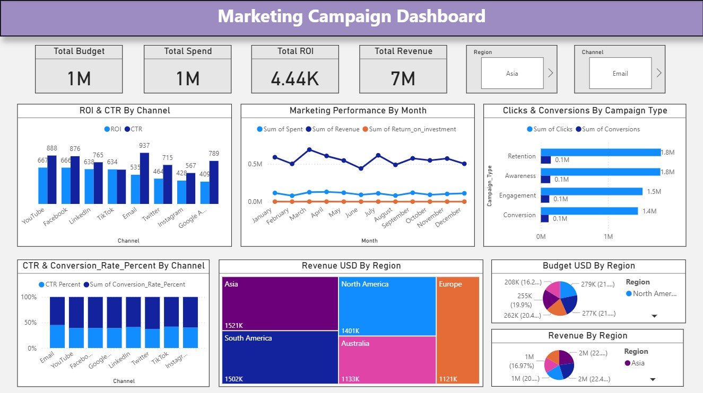

# **Marketing Campaign Dashboard**

This project presents an interactive and data-driven **Marketing Campaign Dashboard** built using **Microsoft Power BI**.
The dashboard provides a complete analysis of campaign performance across multiple channels, regions, and campaign types.

## **📌 Project Overview**

The goal of this dashboard is to visualize and analyze a marketing campaign dataset to help stakeholders understand:

* How the marketing budget is being utilized
* Which channels are performing best
* Monthly revenue and ROI trends
* Conversion effectiveness across campaigns
* Regional contribution to overall revenue

## **📊 Key Features & Insights**

### **1. ROI & CTR Analysis**

* **ROI (Return on Investment)** comparison across major channels
* **CTR (Click-Through Rate)** trends to evaluate engagement

### **2. Monthly Marketing Performance**

* Monthly trends of:

  * **Spend**
  * **Revenue**
  * **ROI**
* Helps identify seasonal patterns and performance fluctuations

### **3. Campaign Type Performance**

* Comparison of:

  * **Clicks**
  * **Conversions**
  * **Conversion Rate (CR)**
* Highlights which campaign types drive the highest results

### **4. Regional Revenue Distribution**

* Total **Revenue (USD)** by region using a treemap
* Highlights top-performing global markets

### **5. Budget Allocation**

* Region-wise budget distribution
* Shows how marketing resources are allocated internationally

### **6. CTR% & CR% Breakdown**

* Detailed percentage comparison of:

  * **CTR% (Click-Through Rate Percentage)**
  * **CR% (Conversion Rate Percentage)**
* Provides insights into channel effectiveness

## **🛠 Tools & Technologies**

* **Power BI Desktop**
* **DAX (Data Analysis Expressions)**
* **Excel / CSV** (for dataset preprocessing)

## **📂 Files Included**

- `Marketing Campaign Dashboard.pbix` → Power BI dashboard file  
- `marketing_datasetrows.csv` → Sample dataset
- `MarketingCampaign.jpg` → Screenshot of the dashboard  
- `README.md` → Project documentation  

## 📷 Dashboard Preview

## 🚀 How to Use
1. Download the `.pbix` file from this repository  
2. Open it in **Power BI Desktop**  
3. Connect to your Marketing dataset (or use the sample provided)  
4. Explore interactive visualizations!  
